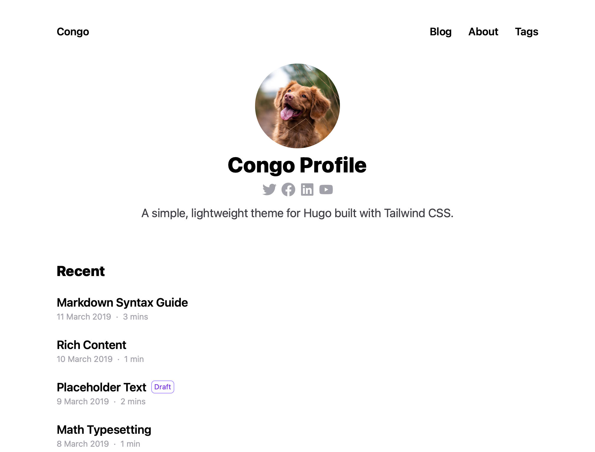

Congoは柔軟なホームページレイアウトを提供します。2つのメインテンプレートから選択でき、追加設定でデザインを調整できます。また、独自のテンプレートを用意して、ホームページの内容を完全にコントロールすることもできます。

ホームページのレイアウトは `params.toml` 設定ファイルの `homepage.layout` 設定によって制御されます。さらに、すべてのレイアウトには[最近の記事](#最近の記事)を表示するオプションがあります。

## ページレイアウト

デフォルトのレイアウトはページレイアウトです。これはシンプルにMarkdownコンテンツを表示します。静的なウェブサイトには最適で、多くの柔軟性を提供します。

ページレイアウトを有効にするには、 `params.toml` 設定ファイルで `homepage.layout = "page"` を設定します。

## プロフィールレイアウト

プロフィールレイアウトは、個人のウェブサイトやブログに最適です。画像とソーシャル・プロフィールへのリンクを提供することで、著者の詳細を前面に押し出します。

著者情報は `languages` 設定ファイルで提供されます。パラメーターの詳細については、[はじめに]()と[言語と国際化]()セクションを参照してください。

さらに、ホームページのコンテンツで提供されるすべてのMarkdownコンテンツは、著者プロフィールの下に配置されます。これにより、ショートコードを使用した著者の略歴やその他のカスタムコンテンツを表示するための柔軟性が増します。

プロフィールレイアウトを有効にするには、 `params.toml` 設定ファイルで `homepage.layout = "profile"` を設定します。

## カスタムレイアウト

組み込みのホームページレイアウトがあなたのニーズに十分でない場合は、独自のカスタムレイアウトを提供するオプションがあります。これにより、ページの内容を完全にコントロールすることができ、白紙の状態から作成することができます。

カスタムレイアウトを有効にするには、 `params.toml` 設定ファイルで `homepage.layout = "custom"` を設定します。

設定値が設定された状態で、新しい `custom.html` ファイルを作成し、 `layouts/partials/home/custom.html` に配置してください。これで、 `custom.html` ファイルにあるものは何でも、サイトのホームページのコンテンツエリアに配置されるようになります。レイアウトの定義には、HTML、Tailwind、Hugoのテンプレート関数など、お好きなものをお使いください。

カスタムレイアウトに[最近の記事](#最近の記事)を含めるには、 `recent-articles.html` パーシャルを使います。

例として、このサイトの[ホームページ]()では、カスタムレイアウトを使ってページとプロフィールのレイアウトを切り替えられるようにしています。[GitHub repo](https://github.com/jpanther/congo/blob/dev/exampleSite/layouts/partials/home/custom.html)を訪問して、どのように動作するか見てみましょう。

## 最近の記事

すべてのホームページレイアウトには、メインページコンテンツの下に最近の記事を表示するオプションがあります。これを有効にするには、 `params.toml` 設定ファイルの `homepage.showRecent` 設定を `true` にするだけです。

このセクションにリストされる記事は、 `mainSections` 設定から派生したもので、あなたのウェブサイトで使用しているコンテンツタイプに対応します。例えば、 _posts_ と _projects_ のコンテンツセクションがある場合、この設定を `["posts", "projects"]` に設定することで、これら2つのセクションにあるすべての記事が最近の記事リストに出力されます。Congoはこの設定が配列であることを想定しているので、すべてのコンテンツに1つのセクションしか使用しない場合は、この設定を適宜変更してください: `["blog"]`
